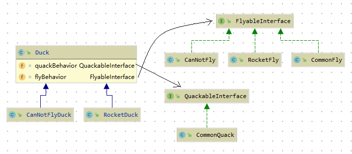

# 策略模式

在 [nopattern](./src/main/java/org/potter/strategy/nopattern) 目录下是没有使用模式的代码，如果要在其中的父类中添加fly方法，

那么他的所有子类中将继承该fly方法，这会导致某些不该有fly()的子类也拥有了这个方法。

当然可以在不希望有fly() 方法的子类中覆盖对应的方法。[NoPatternDuckTest](./src/test/java/org/potter/stategy/nopattern/NoPatternDuckTest.java)是对创建的子类功能进行的测试。

如果需求不断的变更，父类需要不断的修改，子类可能需要不断的跟着重写各种方法。

设计模式第一条: 将变化的部分和不变化的部分进行分离

在 [pattern](./src/main/java/org/potter/strategy/pattern) 目录下采用了将变化的部分进行单独抽取的方式进行封装。

类关系图如下：

在将Duck中存在变化的两类行为抽象出来，封装成 flyableInterface, quackableInterface

并将对应的接口作为Duck的两个属性组合注入到Duck类中（"针对接口编程"真正的意思是"针对超类型编程"）

针对接口编程关键就在多态。

    利用多态，程序可以针对超类型编程，执行时会根据实际情况执行到真正的行为，不会绑死在超类型的行为上。

针对超类型编程可以更明确地说成：
    
    变量的声明类型应该是超类型，通常是一个抽象类或者是一个接口，如此，只要是具体实现此超类型的类锁产生的对象，都可以指定给这个变量。
    这也意味着，声明类型时可以不用理会以后执行时的真正对象类型