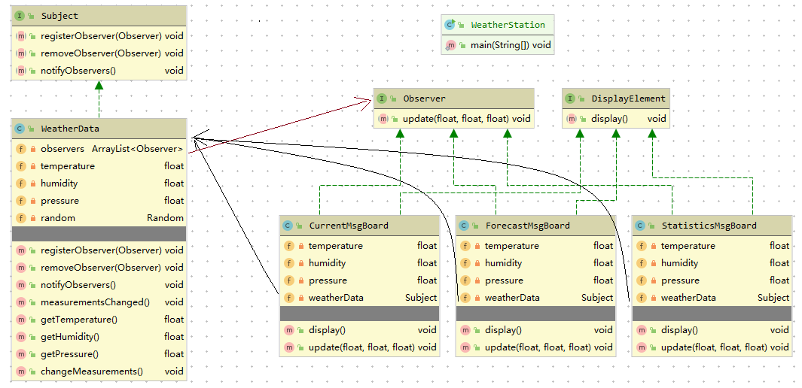

# 观察者模式

案例：气象观测站

包括3部分
1. 气象站 -> 获取实际气象数据的物理装置
2. WeatherData -> 追踪来自气象站的数据，并更新布告板
3. 布告板(有三种类型) -> 显示目前天气状况

这三部分协调合作，每当数据有更新，实时显示出来。

```java
class WeatherData{
    getTemperature();
    getHumidity();
    getPressure();
    measurementsChanged(){
    // 一旦有数据更新，次方法会被调用
    }
}
```

目前知道什么？

+ WeatherData有三个getter 方法，可以取得三个测量值
+ 当数据更新时，measurementsChanged() 会被调用
+ 需要实现三个使用天气数据的布告板：目前状况，气相统计，天气预报。一旦数据变化，这三个布告板需要马上更新
+ 系统必须可扩展，让其他开发人员可以定制布告板，用户可以随意添加或删除任何布告板。

观察者模式：杂志订阅

1. 报社的业务就是出版报纸
2. 向某家报社订阅报纸，只要他们有新的报纸出版，就会给你送来，只要你是他们的订户，你就会一直收到信报纸
3. 当你不想再看报纸的时候，取消订阅，他们就不会再送新报纸过来
4. 只要报社还在营业，就会一直有人向他们订阅报纸或者取消订阅

出版者 + 订阅者 = 观察者模式

    出版者：主题   [Subject]
    
    订阅者：观察者 [Observer]

在气象站这个需求中：
    
    设备：出版者，主题
    
    布告板：订阅者，观察者

观察者模式：定义了对象间的一对多依赖，这样一来，当一个对象改变状态时，它的所有依赖者都会受到通知并自动更新。



说明：

主题提供3个方法：注册、注销、通知观察者

观察者提供一个方法：更新状态

DisplayElement为布告板提供了统一的接口,当布告板板需要显示信息是调用此接口的display() 方法

[WeatherData](./src/test/java/org/potter/observer/WeatherStation.java) 是整个气象站的载体，用于启动气象站运转

总结：

面向对象设置原则：
1. 封装变化
2. 多用组合，少用继承
3. 针对接口编程，不针对实现编程
4. <u>为交互对象之间的松耦合设计而努力</u>

观察者模式：

    在对象之间定义一对多的依赖，这样一来，当一个对象改变状态，依赖的对象都会收到通知，并自动更新。
