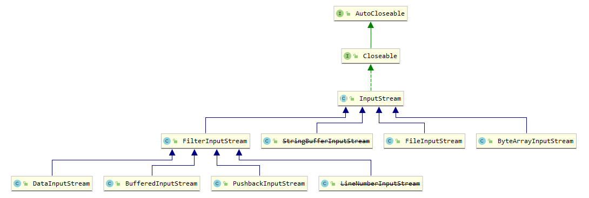

# 装饰者模式

星巴兹咖啡店订单改造，希望能够改变这种复杂的设计。

最开始的设计是这样的

当咖啡店的品类越来越多是，结果是这样的

即每种品类的咖啡，都需要自己实现对应的cost，进行单独的价格计算。

如果中间出现，部分原料打折的情况，或者新推出一种焦糖调料风味，计算价格的改动将会非常大……

如果能将设计进行调整，每种原料能在原来的基础上叠加计算，那这种设计的弹性将会提高很多。

我们的目标是允许类容易扩展，在不修改现有代码的情况下，就可搭配新的行为。

如果实现这样的目标，有什么好处呢？这样的设计具有弹性可以应对改变，可以接受新的功能来应对改变的需求。

许多模式是长期经验的实证，可以通过提供扩展的方法来保护代码免于被修改。装饰者模式，完全遵循开放-关闭原则。

+ 装饰者和被装饰者有相同的类型
+ 可以用一个或多个装饰者包装一个对象
+ 既然装饰者和被装饰者有相同的超类型，所以在任何需要原始对象（被包装的）的场合，可以用封装过的对象代替它。
+ 装饰者可以在所委派被装饰者的行为之前/或之后，加上自己的方法，以达到特定的目的。
+ 对象可以在任何时候被装饰，所以可以在运行时动态地，不限量地用我喜欢的装饰者来装饰对象。

[解决方法]

1. 把饮料抽象为超类

2. 调料作为装饰者，与饮料组合起来。

3. 然后分别实现饮料和调料两种超类。

[测试类入口](./src/test/java/org/potter/decorator/StarbuzzCoffeeTest.java)

[总结] 

装饰者模式定义: 动态地将责任附加到对象上。若要扩展功能，装饰者提供了比继承更有弹性的替代方案。

装饰者模式设计图

[深入Java]

在 java.io 包下关于装饰者模式的使用也很多，让我们记忆混乱的 inputStream 中随处可见

